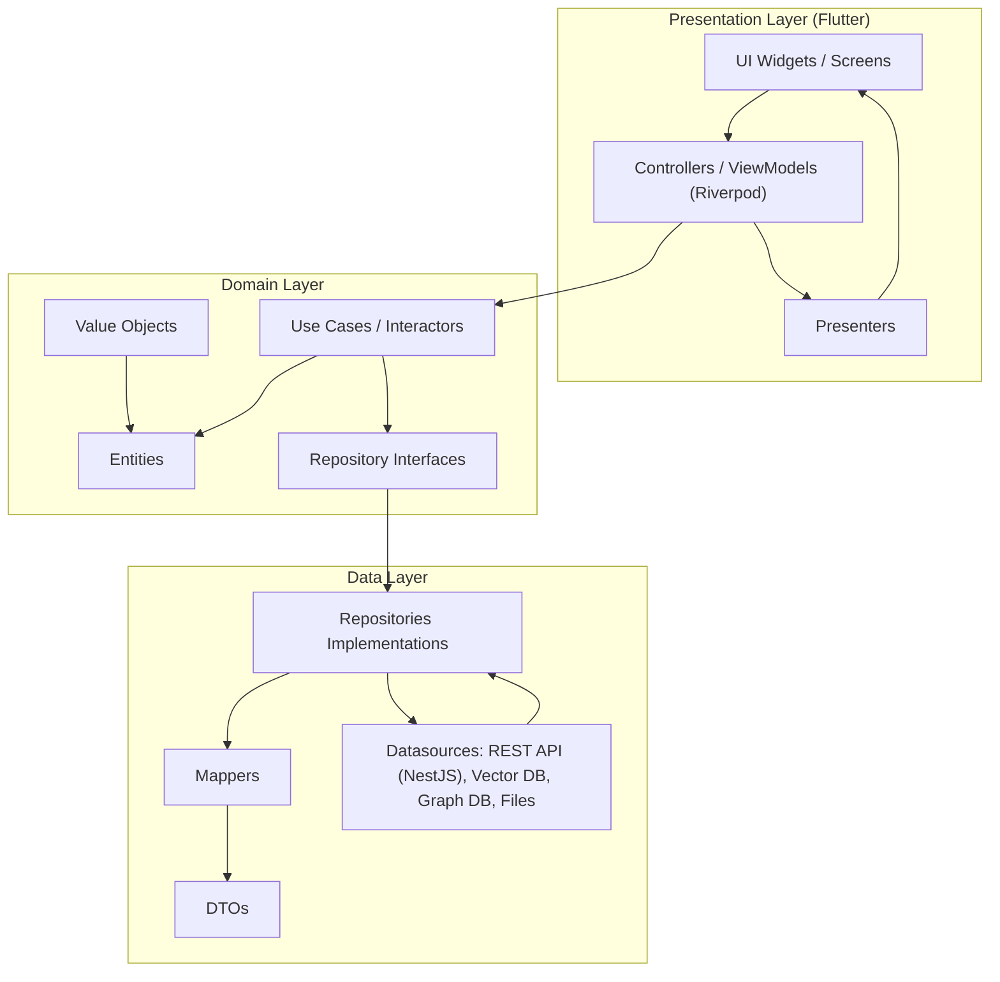
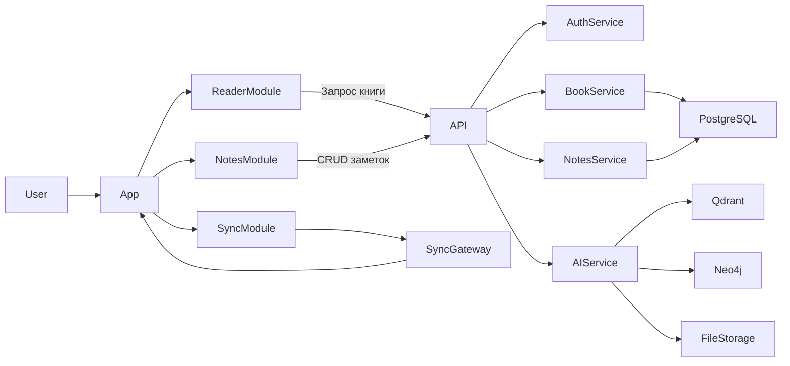
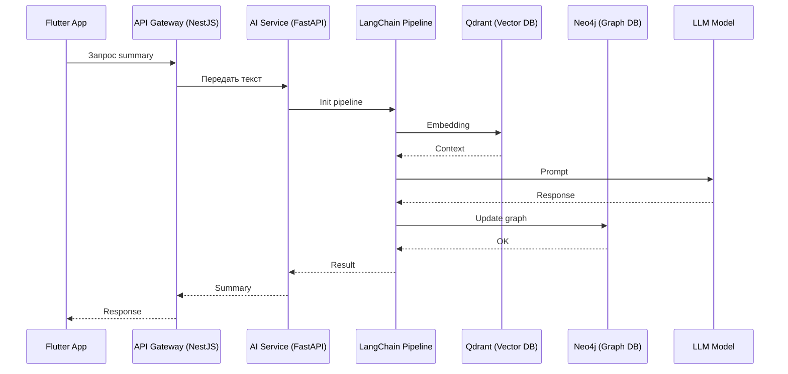
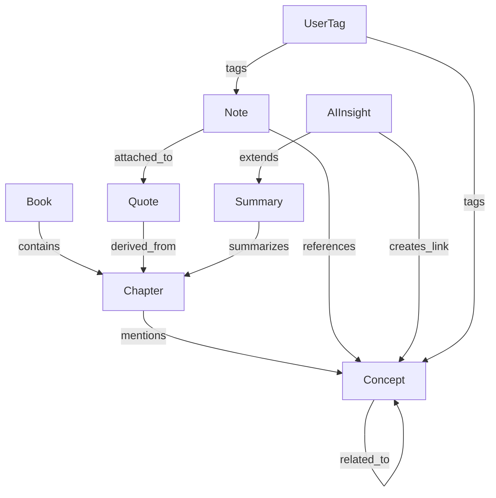

# Диаграммы архитектуры проекта

## 1. Clean Architecture (Domain / Data / Presentation)

```mermaid
flowchart TB
subgraph Presentation["Presentation Layer (Flutter)"]
    UI["UI Widgets / Screens"]
    Controllers["Controllers / ViewModels (Riverpod)"]
    Presenters["Presenters"]
end
subgraph Domain["Domain Layer"]
    Entities["Entities"]
    ValueObjects["Value Objects"]
    UseCases["Use Cases / Interactors"]
    RepositoriesInterfaces["Repository Interfaces"]
end
subgraph Data["Data Layer"]
    DTOs["DTOs"]
    Mappers["Mappers"]
    RepositoriesImpl["Repositories Implementations"]
    Datasources["Datasources: REST API (NestJS), Vector DB, Graph DB, Files"]
end
UI --> Controllers
Controllers --> UseCases
Presenters --> UI
UseCases --> RepositoriesInterfaces
RepositoriesInterfaces --> RepositoriesImpl
RepositoriesImpl --> Datasources
Datasources --> RepositoriesImpl
RepositoriesImpl --> Mappers
Mappers --> DTOs
ValueObjects --> Entities
UseCases --> Entities
Controllers --> Presenters
```

## 2. Диаграмма потоков данных (Data Flow)

```mermaid
flowchart LR
User --> App
App --> ReaderModule
App --> NotesModule
App --> SyncModule
ReaderModule -->|Запрос книги| API
NotesModule -->|CRUD заметок| API
API --> AuthService
API --> BookService
API --> NotesService
API --> AIService
BookService --> PostgreSQL
NotesService --> PostgreSQL
AIService --> Qdrant
AIService --> Neo4j
AIService --> FileStorage
SyncModule --> SyncGateway
SyncGateway --> App
```

## 3. AI-пайплайн

```mermaid
sequenceDiagram
    participant App as Flutter App
    participant API as API Gateway (NestJS)
    participant AI as AI Service (FastAPI)
    participant Lang as LangChain Pipeline
    participant Vec as Qdrant (Vector DB)
    participant Graph as Neo4j (Graph DB)
    participant LLM as LLM Model
    App->>API: Запрос summary
    API->>AI: Передать текст
    AI->>Lang: Init pipeline
    Lang->>Vec: Embedding
    Vec-->>Lang: Context
    Lang->>LLM: Prompt
    LLM-->>Lang: Response
    Lang->>Graph: Update graph
    Graph-->>Lang: OK
    Lang-->>AI: Result
    AI-->>API: Summary
    API-->>App: Response
```

## 4. Структура базы знаний

```mermaid
graph TD
Book -->|contains| Chapter
Chapter -->|mentions| Concept
Quote -->|derived_from| Chapter
Note -->|attached_to| Quote
Note -->|references| Concept
Summary -->|summarizes| Chapter
AIInsight -->|creates_link| Concept
AIInsight -->|extends| Summary
Concept -->|related_to| Concept
UserTag -->|tags| Note
UserTag -->|tags| Concept
```
